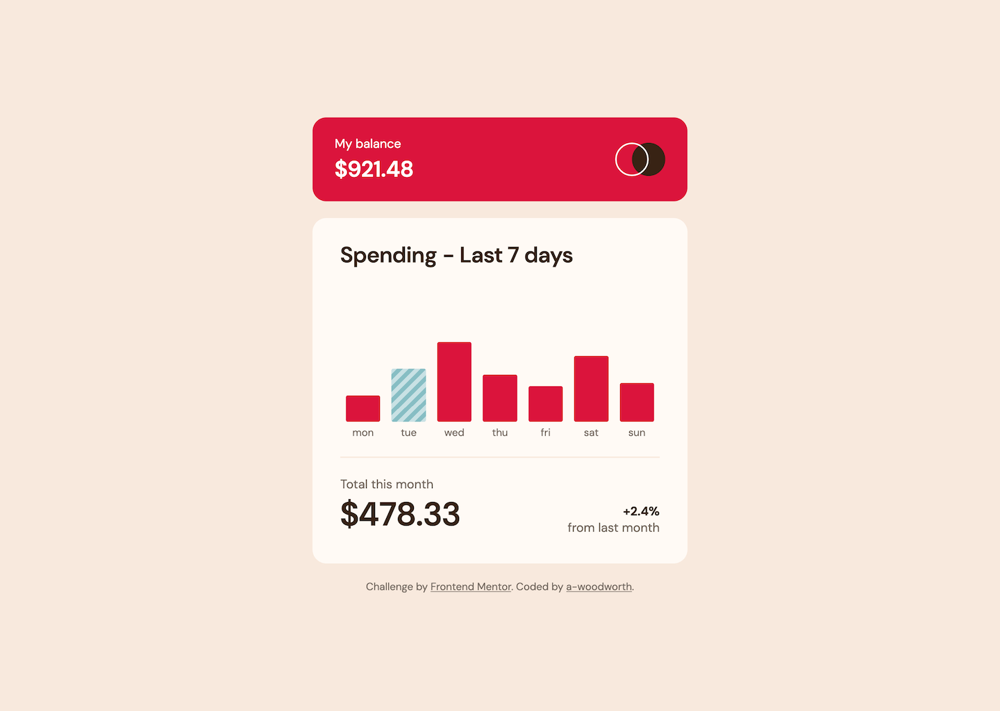
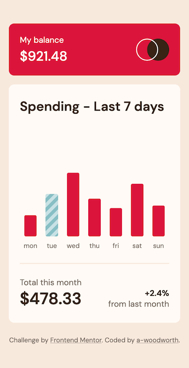

# Frontend Mentor - Expenses chart component solution

This solution to the [Expenses chart component challenge on Frontend Mentor](https://www.frontendmentor.io/challenges/expenses-chart-component-e7yJBUdjwt) uses the Charts.css data visualization framework. Color modifications have been made that differ from the design to meet accessible color contrast ratios.

## Table of contents

- [Overview](#overview)
  - [The challenge](#the-challenge)
  - [Screenshots](#screenshots)
  - [Links](#links)
  - [Built with](#built-with)

## Overview

### The challenge

Users should be able to:

- View the bar chart and hover over the individual bars to see the correct amounts for each day
- See the current day’s bar highlighted in a different colour to the other bars
- View the optimal layout for the content depending on their device’s screen size
- See hover states for all interactive elements on the page
- **Bonus**: Use the JSON data file provided to dynamically size the bars on the chart

### Screenshots

**Desktop**

**Mobile**

### Links

- Solution URL: [Solution](https://www.frontendmentor.io/solutions/expenses-chart-component----chartscss-framework-and-javascript-_01GwTWpG5)
- Live Site URL: [Live Site](https://a-woodworth.github.io/expenses_chart_component)

### Built with

- Semantic HTML5 markup
- CSS Custom properties (variables)
- JavaScript
- [Charts.css](https://chartscss.org) - CSS Data Visualization Framework
